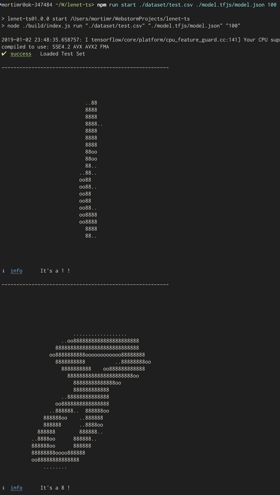

# lenet-ts
### 🧠 LeNet Convolutional Neural Network with Tensorflow and Typescript: 28x28 grayscale hand written digits recognition

/!\ This is a heavy repository as the MNIST dataset is pushed with it for convenience.

### Neural Network Architecture

| Layer Type | Input Shape | Info |
| :--:       | :--:        | :--: |
| 2D Convolutional | 28x28x1 (grayscale image size) | kernel of size 5, stride of 1, 8 filters, `relu` activation |
| 2D Max Pooling | 24x24x8 | pool size of 2x2, stride of 2;2 |
| 2D Convolutional | 12x12x8 | kernel of size 5, stride of 1, 16 filters, `relu` activation |
| 2D Max Pooling | 8x8x128 | pool size of 2x2, stride of 2;2 |
| Fully Connected Layer | 4x4x128 | `relu` activation |
| Fully Connected Layer | 64 | `softmax` activation |
| Output | 10 | One-Hot style output|

### Usage

#### Install dependencies

`npm install`

#### Build Sources

`npm run build`

#### Train Model

`npm run train ./dataset/train.csv <path-to-dump-model>`

#### Predict

`npm run start ./dataset/test.csv <path-to-dump-model>/model.json <amount-to-guess>`

### Output

